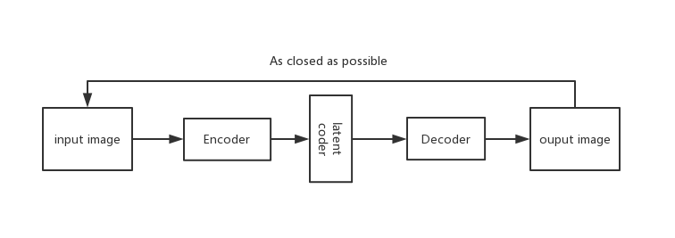
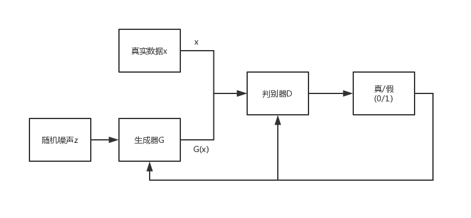

#  基于Attention GCN 技术的图像生成
## 摘要
图像生成一直是计算机视觉领域的一个巨大挑战，为了生成更加真实的图像，图像生成模型需要考虑诸多方面的影响。条件生成式对抗网络(CGAN)广泛用于图像生成，包括text-to-image、image-to-image。但是这些模型的只是对于单场景图像的生成比较友好，因此为了生成更加复杂的多场景图像，本文引入一种graph-to-image模型。该模型主要优点在于模型输入为graph，而graph是一种可以很好地表征图像中的对象以及它们之间的关系的数据结构。Scott等使用一种图卷积网路(GCA)对 输入graph进行处理以实现端对端模型，但是这种方式默认所有的对象都是平等的关系。为了考虑不同对象之间的主次关系，本文在图卷积中引入一种注意力机制，实现不同对象之间的主次、远近、方位等关系属性。本文在COCO数据集上对本文方法进行实验， 证实本文方法对于生成图像中的对象有更好的区分度。

## 1 引言
随着深度学习的巨大发展，越来越多的人工智能领域问题运用深度学习的方式来解决。图像生成是计算机视觉领域一项巨大的挑战，其关键思想就是找到一个低维的表示潜在空间(latent space)，其中任意一点可以映射为有一张逼真的图像，由于深度学习可以较好地利用反馈信息对模型进行调整，因此运用深度学习可以通过学习的方式得到理想的图像生成模型。

基于深度学习思想的三大生成模型：变分自编码器(Variational autoencoder)、生成式对抗网络(Generative Adversarial Network)、自回归方法(autoregressive approaches)。变分自编码器(VAE)是通过变分推理的方式联合地学习一对 *编码器(encoder)* 和 *解码器(decoder)* 组，实现真实图像与潜在空间(latent space)的映射关系。生成式对抗网络(GANs)联合地学习一对 *生成器(G)* 和 *判别器(D)*，生成器通过随机噪声生成假图像，而判别器则判断输入为生成的假图像还是还是真实数据集。自回归方法是依据前面的所有像素预判下一个像素的生成。{@fig:vae}

{#fig:vae}
{#fig:gan}

近期由于GANs网络的火热，学术界提出大量GANs的变种,比如条件生成对抗网络(CGAN)、信息生成对抗网络(InfoGAN)以及深度卷积对抗网络(DCGAN)等，这些模型为图像生成做出了巨大贡献。Scott Reed等[@]运用CGAN模型实现基于文本描述生成与文本语义相关的图像。但是这个模型并不完美，如果简单地调整输出图形的大小来生成高分辨率图像时，就会产生很多无意义的输出。因此Han zhang等[@]在此基础上提出StackGAN模型，它有两个GAN模型。第一个GAN输入文本序列，输出包含图像大致形状和颜色；第二个GAN以第一个GAN的生成的低分辨率图像和嵌入式文本向量作为输入，高分辨率图像作为输出。这个模型已经能生成照片般真实的图像，但是对于对于关系复杂的图像的生成并不很友好，当描述文本包含多个对象和多种关系的时候生成图像就会显得不够真实。因此Justin Johnson等[@]讲文本序列替换成scene graph作为输入，通过一个graph convoluition network沿着graph的边进行处理，将获取的信息用于预测一个scene layout,并输入到一个 *级联细化网络(cascaded refinement network)* 来生成图像。

为使生成图像更加真实，图像中的对象包含更多细节，对象之间的关系更加明确。本文将生成scene layout 再次映射到潜在空间，并将潜在向量作为GAN中生成器的输入，生成图像和真实图像作为判别器的输入对抗式训练。此时生成图像包含复杂场景图像中的各个对象以及它们之间的大致关系，为使这些对象和对象之间关系包含更多细节，本文训练一个新的GAN网络，将前一阶段的生成图像以及scene graph卷积向量作为输入，以输出像照片一般真实的高分辨的复杂场景图像。

## 2 相关研究背景
图像生成模型是计算机视觉领域的一个基本问题，随着深度学习的出现，这方面取得了显著进步。而生成式对抗网络(GAN)在生成清晰图像方面展现了非常强势的一面，它的一个变种条件生成对抗网络(CGAN)使用最为广泛。

条件图像生成模型常用一些额外简单条件替换随机变量作为生成器或者判别器的输入，比如Xinchen Yan等[@]将视觉属性作为GAN模型的输入来生成图像；Odena等[@]实现以类别标签作为条件变量生成图像；Scott Reed等[@]通过将文本序列转换为词向量作为条件输入，实现了 *text-to-image* 模型。当然还有很多是将图像作为条件生成图像的，包括：超分辨率重建(SRGAN)[@]、照片编辑[@]、域转换[@]。

由于文本序列一个单词接着一个单词的线性结构，很难表征一副具有多个对象和复杂关系的图像，因此本文引入scene graph作为GAN模型的条件变量，如图所示{fig：}，相对自然语言文本而言，它更能清楚地表示对象以及它们之间的关系，scene graph更像是自然语言和图像之间的过渡桥梁。同时，scene graph还广泛应用于图像语义检索[@]、评估和改进图像标题[@]。Schuster等[@]实现将文本描述转换为scene graph,以及从图像中预测scene graph[@]。

为了生成一张能尽可能表征scene graph的图像，就需要对scene graph尽心前期处理，将graph中的对象和对象之间的关系转换为向量。为此本文采用图卷积网络(graph convolution network)[@],沿着graph的边传递信息。然后我们需要根据获得的信息向量构建一个图布局，这个图布局包括途中所有对象的边界框和分割掩模。运用级联细化网络慢慢提升图布局的空间尺度以得到最终生成图像。

除了使用单一的GAN模型来生成图像，还可以利用多个GAN来进行图像生成操作[@]。Han zhang等[@]提出使用两个阶段来生成图像，第二阶段旨在增强细节。但是它只适用于简单图像，比如鸟类或者花类图像的生成。本文采用第二阶段的GAN不仅可以细化对象，并且能清晰增强对象之间的关系，生成更假真实的图像。

## 3  网络模型结构
如图所示，本文模型主要有如下部分组成：Attention GCN用于处理输入图像，得到包含相邻节点信息的节点向量；Object Layout Net是根据新的节点向量生成Scene Layout； Cascaded Refinement Network通过一系列卷积细化模块合成高度表征对象布局的图像。

使用如下公式表示graph-to-iamge模型,其中输入$g$表示场景图，$z$表示噪声，$I$为输出图像。
$$
I = f(g,z)
$$
$f$即为目标所求，我们需要保证得到的函数f使得生成图像$I$和真实图像$\hat{I}$尽可能的相似，即：
$$
\min L= \{I, \hat{I}\}
$$

### 3.1 scene graph
 本文的模型输入是一个描述对象和对象之间关系的场景图。给定一个对象类别集$C$和一个关系类别集$R$，其中一个元组$(O,E)$就表示一张场景图。其中$O={\{o_1,o_2,\dots o_n \}}$表示图中所有的节点，$o_i\in C$，$n$为节点数；$E\subseteq O \times R \times O$是由${(o_i, r, o_j)}$形式组成的有向边的集合，其中$o_i, o_j\in C, r \in R$。

作为第一步处理，通过学习得到一个嵌入层可以将有向图中的节点和边都转换为密集型向量，类似于自然语言处理中的词嵌入层。
### 3.2 Attention GCN
相对于传统的image和text等规则的数据结构，graph的不规则性意味着其可以表示更丰富的信息。场景图的节点表示网络中的个体，边表示个体之间的关系。为了整合由图结构提供的上下文信息，以端对端的方式处理图，提出图卷积模型对输入图进行处理。

在GCN中，每个节点$o_i$有一个表示特征向量$h_i \in \Re^{D_{in}}$，$D_{in}$表示输入图的节点和边的特征向量的维度。首先通过训练学习得到线性变换矩阵$W$, 变换图中每个节点的相邻节点$\{h_j|j \in N(j)\}$。然后用预先设定的权重 $\alpha$ 收集这些变换,接着输入至非线性函数$\sigma$(ReLU)中。这种逐层变换可以写作：

$$
h_i^{(l+1)}=\sigma(h_i^{(l)} + \sum \alpha_{ij}W h_i^{(l)})
$$

或者可以等价地将节点表示收集至矩阵$H \in \Re^{d \times Tn}$，

$$
h_i^{(l+1)}=\sigma(WZ^{(l)} \alpha_i )
$$

在传统的GCN中，图中的连接是已知的，并且条件系数 $\alpha_i$ 是基于特征向量的对称归一化领接矩阵预先设定的。

在本文中，我们额外加入注意力机制，通过训练学习的方式调节条件系数 $\alpha$。为了从相邻节点特征中预测注意力，我们训练一个具有连续节点特征的两层 **MLP**，并再得到的结果分数上计算softmax。节点$o_j$的注意力计算公式如下：

$$
u_{ij}=w_h^T \sigma(W_a[h_i^{(l)}, h_j^{(l)}]) \\
\alpha_i = softmax(u_i)
$$

其中，$w_h$和$W_a$是通过学习得到的参数，$[\cdot , \cdot]$表示连接操作。根据定义，我们设置 $\alpha_{ii}=1$ 及 $\alpha_{ij}=0 \forall j \notin N(j)$。由于注意力是节点特征的函数，因此每次迭代都会导致注意力发生变化，从而影响连续迭代。
### 3.3 Object Layout Network
Attention GCN 通过一系列图像卷积处理输入场景图为每个对象提供嵌入式向量，该向量聚合图中所有对象和关系的信息。

为了生成图像，我们必须从图域移动到图像域。 为此，我们使用对象嵌入向量来计算场景布局，该场景布局给出了要生成的图像的粗糙2D结构; 我们通过使用对象布局网络为每个对象预测分段掩码和边界框来计算场景布局，如图4所示。

对象布局网络接收一个维度为$D$的表示结点对象$o_i$的嵌入向量$h_i$,并将其通过 *掩模回归网络* 来预测一个形状为$M \times M$的二进制掩模 $\hat m_i$以及通过 *框回归网络* 来预测一个边界框 $\hat b = (x_0, y_0, x_1, y_1)$ 。掩模回归网络由几个以S形非线性终止的转置卷积组成，因此掩模的元素位于范围$(0,1)$中; 框回归网络是**MLP**层。

将嵌入式向量好$h_i$和掩模相乘得到形状为$D \times M \times M$的掩模嵌入，然后用双线性插值法将其扭曲到边界框的位置以给出对象布局。然后场景布局是所有对象布局的总和。

在训练过程中，我们使用真实的边界框 $b_i$ 来计算场景布局; 在测试时，我们改为使用预测的边界框 $\hat b_i$。
### 3.4 Cascaded Refinement Network
给定场景布局，我们必须合成一个尊重布局中给出的对象位置的图像。 对于此任务，我们使用级联细化网络[6]（CRN）。 CRN由一系列卷积细化模块组成，模块之间的空间分辨率加倍; 这允许生成以粗到细的方式进行。

每个模块接收场景布局（下采样到模块的输入分辨率）和前一模块的输出作为输入。这些输入通道连接并传递给一对3×3卷积层; 然后，在传递到下一个模块之前，使用最近邻插值对输出进行上采样。

第一个模块将高斯噪声$z \sim p_z$作为输入，最后一个模块的输出传递给两个最终的卷积层以产生输出图像。

### 3.5 鉴别器网络
为了保证生成图像更加真实并包含真实、可识别的对象，还需通过一对鉴别器网络$D_{img}$和$D_{obj}$对抗训练。每一个模型组件我们再后面都会做更详细介绍。
### 2.6 训练

## 3 实验和结果分析
### 3.1 实验数据集和评估方法
#### COCO
#### Visual Genome
####　评估方法
### 3.2 实验结果

## 4 总结
